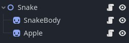

***NOTE**: The Godot 4.0 version of this plugin is currently in development on the `gd-extension`-branch as found [here](https://github.com/2shady4u/godot-sqlite/tree/gd-extension).*

# Snake C#

Basic snake game sample made with C# for Godot 4.0+.

It has a main scene with three nodes:

Each one of the nodes has a script in C# to implement the game logic.

### Requirements
- [.Net 6+ SDK](https://get.dot.net)
- [Godot Engine - .Net 4.0](https://godotengine.org)
- [Visual Studio Code](https://code.visualstudio.com/)
    - [C# Dev Kit Extension](https://marketplace.visualstudio.com/items?itemName=ms-dotnettools.csdevkit)

Remember to modify **[.vscode/launch.json](.vscode/launch.json)** and change **{path_to_godot}** to your installation path to enable debugging on Visual Studio Code.

### Preview:

